# AutoPara — автозапуск пар

A Windows and macOS tray app — and an Android app — for students. It imports a university timetable from a `.docx`, shows
it as a day, week or month calendar, and opens each class's Zoom or Google Meet link in your browser
a minute before the class starts — so all that is left to do is be there. **The application's
interface is Ukrainian**; this README and the design docs are English, for whoever maintains it.

- **Opens each class once, on time** — including when the app was closed for a while: a class you
  missed is never opened behind your back, you are asked.
- **Day, week and month**, with a search box, a subject filter and a group filter, and a small pill
  that says what is on or next today.
- **Editable in place**: click a slot to add a class, drag one to move it (in the week, the day and
  the month). Moving a class that repeats asks whether to move only that date or the whole series.
- **One timetable, every group**: import once, switch course and group without importing again.
- **Light and dark themes**, following the system until you pin one. Windows installer, and macOS
  disk images for Apple Silicon and Intel.
- **Android** (phone and tablet, Ukrainian by default): the same timetable with day, week and month
  views, adding and editing classes by hand, and a notification exactly one minute before each class
  with a one-tap Join that opens the meeting in the native Zoom or Meet app. See
  [android/README.md](android/README.md).

The interface is a light, friendly "education app" look: white cards on a soft grey canvas, each
subject tinting its own cards so a week reads at a glance, one near-black anchor for whatever is
active (today's date, the primary button, the "now" line), and pastel colour only where it carries
meaning — a subject, a status. The dark theme inverts the same pair. The chrome is a floating icon
pill down the left rather than a toolbar across the top, because the week grid is wide and short
and a top bar spends the height a calendar is always short of. Moving between periods and views is
a morph rather than a slide: a class that is on both sides of the change grows from its old shape
into the new one.

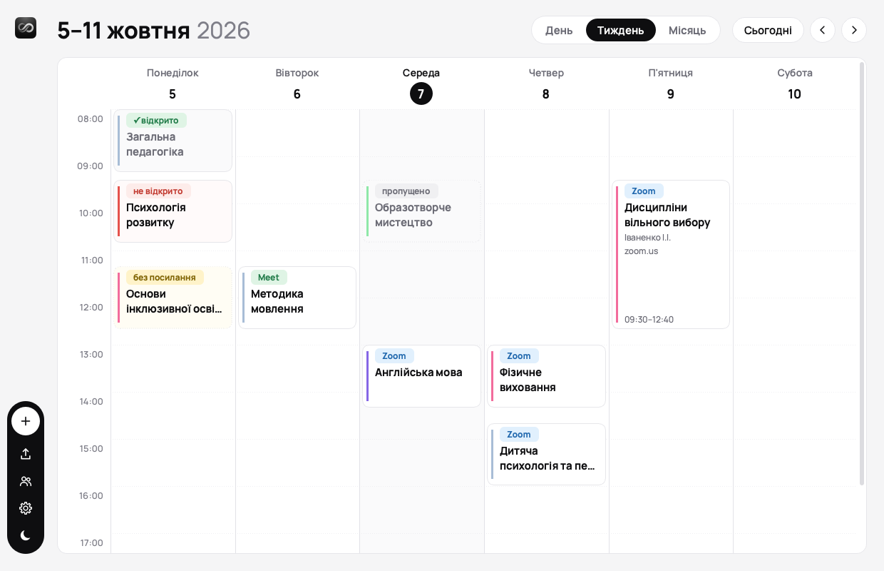

| Dark theme | Month |
| --- | --- |
| 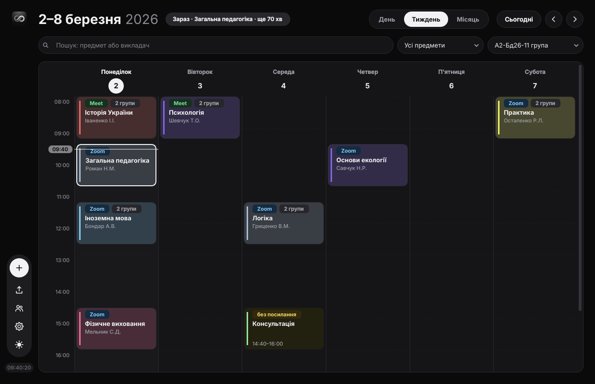 | 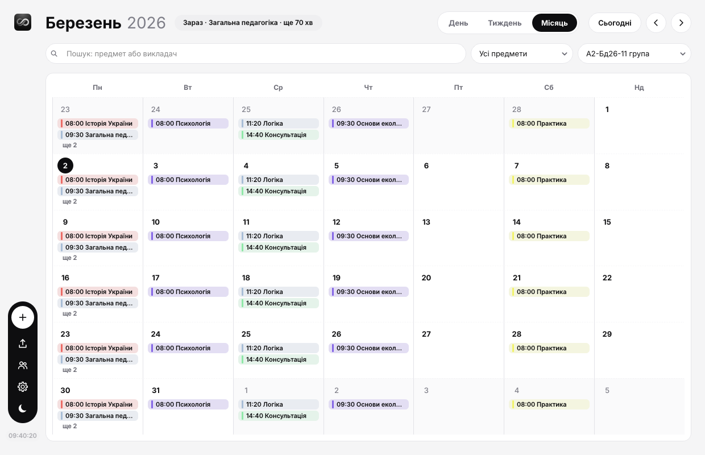 |

| A day | Changing a class | Settings |
| --- | --- | --- |
| 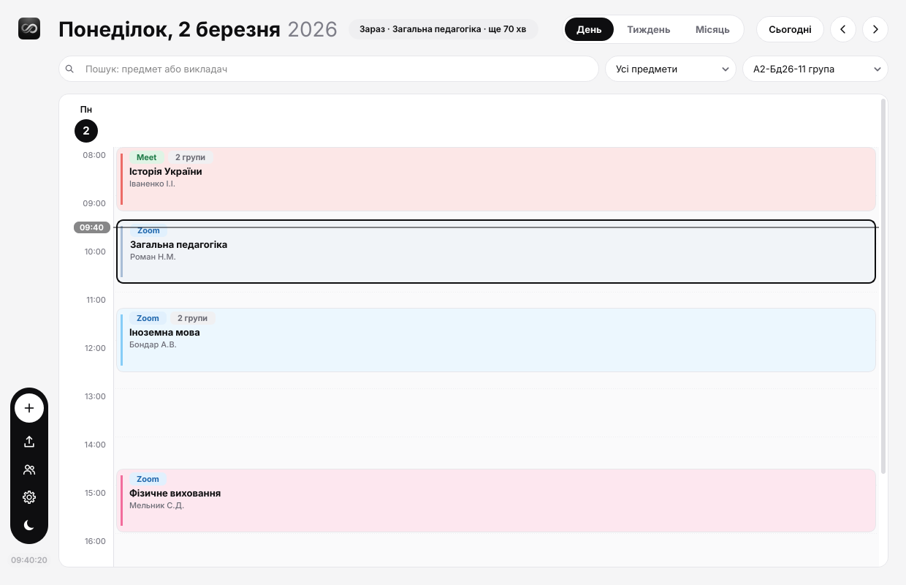 | 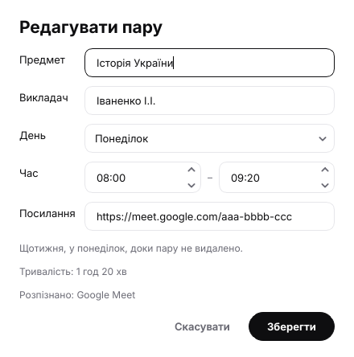 | 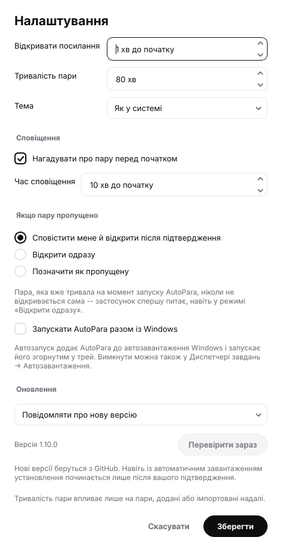 |

*The desktop pictures are rendered from an invented sample timetable by `python tools/screenshots.py`;
the clock in them is pinned to a Monday morning.*

### Android

The same timetable on a phone and a tablet, in Ukrainian (the default; Settings has a language
switch). The pictures are taken on emulators by the
[Android screenshots workflow](.github/workflows/android-screenshots.yml) from the same invented
timetable.

| Day | Week | Month | Editing a class |
| --- | --- | --- | --- |
| 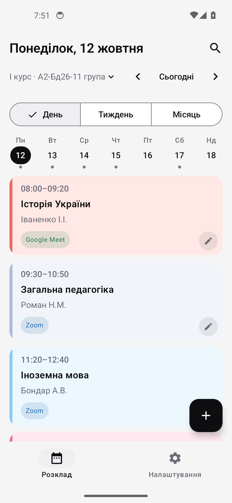 | 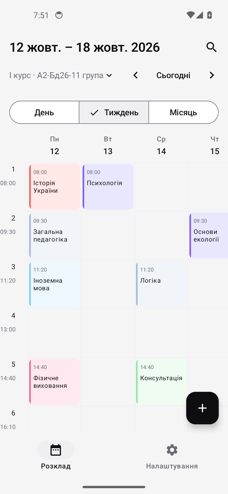 | 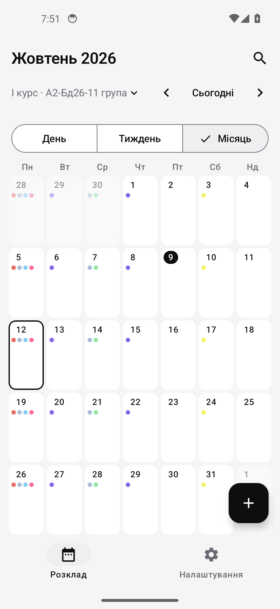 | 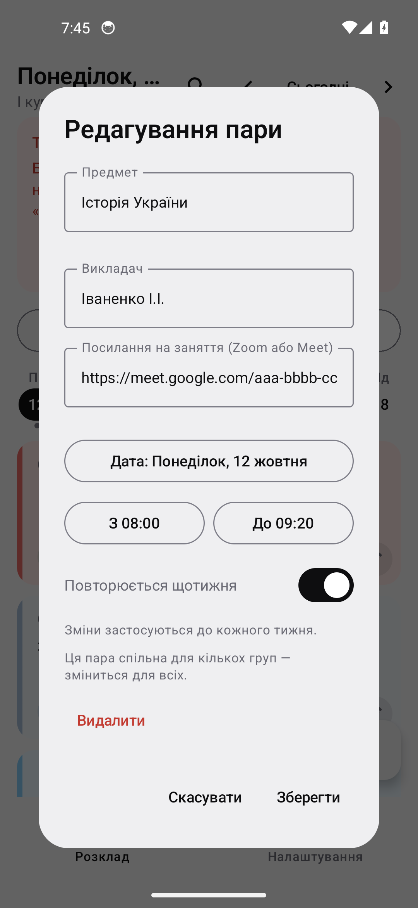 |

| Dark theme | Settings | The reminder, one minute before |
| --- | --- | --- |
| 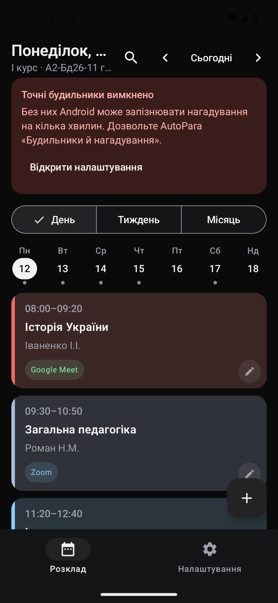 | 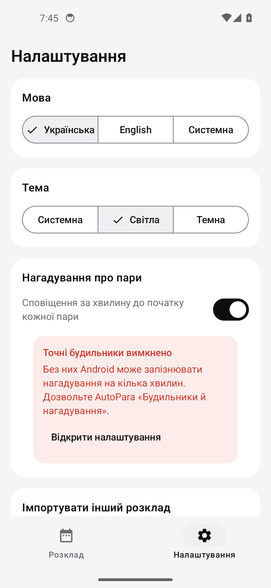 | 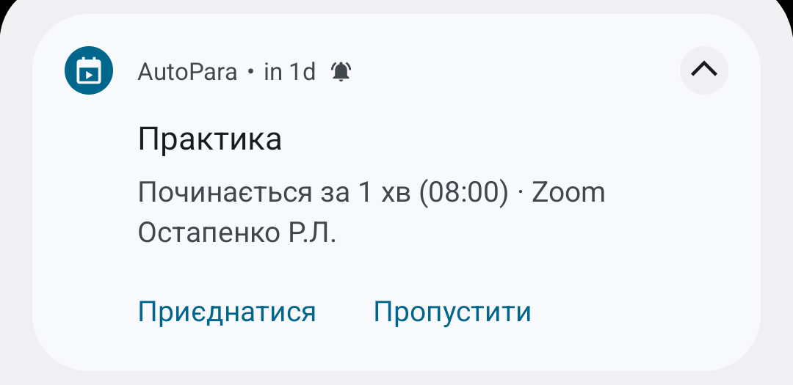 |

On a tablet the week grid has room for all seven days and a details pane sits beside it:

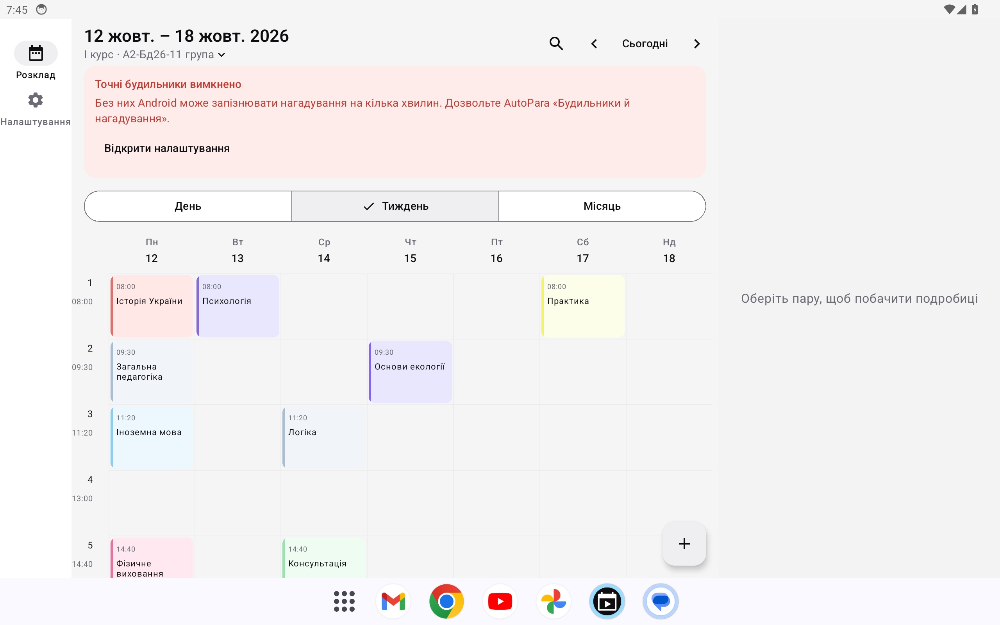

## Install

Download **`AutoPara-<version>-Setup.exe`** from the latest release and run it. That is the whole
procedure. On a Mac, take **`AutoPara-<version>.dmg`** (Apple Silicon) or
**`AutoPara-Intel-<version>.dmg`** (Intel) from the same release. On Android, take
**`AutoPara-<version>.apk`** from it too — every download in a release has the same version number.

The target PC needs **nothing preinstalled** — no Python, no Qt, no VC++ redistributable; they are
all inside the installer. Windows 10/11 64-bit.

It installs per-user to `%LOCALAPPDATA%\Programs\AutoPara`, so there are **no admin rights and no
UAC prompt**. You get Start Menu and (optionally) desktop shortcuts, an entry in Add or Remove
Programs, and an optional "start with Windows" component that launches it hidden in the tray.

Silent install and uninstall are supported with `/S`. Uninstalling keeps your imported timetable in
`%APPDATA%\AutoPara` unless you choose to delete it, so reinstalling does not lose the schedule.

## Run from source

```
python -m pip install -r requirements.txt
python -m autopara
```

On first launch it opens on the import screen: **drag the `.docx` onto it** — anywhere on the
screen, not just the dashed well — or press `Обрати файл…`. Then pick your course and group.

`python -m autopara` also **refreshes the installed copy** from the source it is running out of, so
checking a change is one command rather than a reinstall. Add `--no-rebuild` to skip that.

## Build it yourself

```
python -m pip install pyinstaller     # once
winget install NSIS.NSIS              # once
.\build.cmd
```

| File | Size | What it is |
|---|---|---|
| `dist\AutoPara-1.3.0-Setup.exe` | 35.0 MB | NSIS installer — hand this to someone who does not have the repository. |
| `dist\AutoPara\` | 126 MB folder | The unpacked app, if you'd rather not install. |

`.\build.cmd -SkipApp` rebuilds only the installer from an existing `dist\AutoPara\`.

You do not have to build it to publish it: pushing to `main` runs the same `build.cmd` on a Windows
runner and attaches the installer to a GitHub release
([`.github/workflows/installer.yml`](.github/workflows/installer.yml)). The release is cut from
`APP_VERSION` in `installer/AutoPara.nsi`, and only when that version has no tag yet — so **bump
that number in the commit you want released.** A push that leaves it alone still builds, and the
installer is downloadable from the run's artifacts.

**Run `build.cmd`, not `build.ps1` directly.** Windows refuses to run `.ps1` files at all under its
default execution policy, so `.\build.ps1` fails with *UnauthorizedAccess* on any machine nobody
has configured. `build.cmd` lifts that for the single process it starts — it changes no setting,
for the machine or for you, and needs no administrator. (If you would rather allow scripts for your
own account once and for all, that is
`Set-ExecutionPolicy -Scope CurrentUser RemoteSigned` in an ordinary PowerShell window; it is a
security setting, so it is yours to make, not the build's.)

The build renders the app icon before it packages anything: `build\AutoPara.ico` is drawn from the
same code as the tray glyph, compiled into the executable — which is what every shortcut inherits —
and used for `Setup.exe` and the uninstaller too, so a downloaded installer is recognisable before
it has installed anything. Skipping that step (running PyInstaller or makensis by hand) is allowed:
both fall back to their stock icons.

## How it behaves

- **Opens each class once.** The lead time defaults to 1 minute and is configurable. Restarting the
  app, waking from sleep, or changing the clock cannot cause a second open — the guarantee is a
  database constraint, not in-memory state.
- **A missed class is never opened behind your back.** If a class was already running when AutoPara
  started, the window comes forward with a banner naming it and two buttons — *Підключитися зараз*
  and *Закрити*. Nothing opens until you pick one. This holds even when the catch-up setting says
  "open immediately": that setting applies to a class that starts while the app is running.
- **Reminders.** An optional tray notification a configurable number of minutes before each class.
- **Any-language documents.** Day names are recognised in Ukrainian, Russian, English, Polish,
  German and several other languages; the schedule the app builds from them is always Ukrainian.
- **Editable straight away** — no edit mode. **Left click joins the class**, which is the one thing
  the app exists for, so it costs one click. **Right click opens the actions menu** (open, edit,
  mark as opened or skipped, delete). Click an empty slot to create a class there, drag a class to
  move it -- also in the month, onto another day. Moving a class that repeats asks whether to move
  **only that date** (the rest of the series stays) or the whole series. A class with no link offers
  to add one instead of opening.
- **Search and filters.** A search box finds a class by subject or teacher (Enter jumps to the next
  match, Shift+Enter to the previous one, Ctrl+F focuses the box), a drop-down shows only one
  subject, and another drop-down shows another group of the same course. The count says how much was
  found.
- **Day, week and month**, and a small pill beside the title that says what is on or next today.
  Moving between periods and views is a morph: a class on both sides of the change grows from its old
  shape into the new one, rather than the screen sliding. Each subject tints its cards, so a week can
  be read at a glance.
- **A real calendar day**, 08:00 to 18:00 in hourly rows, with each class drawn across the time it
  actually occupies rather than dropped into a slot — a 09:30 class starts halfway down the 09:00
  row. Columns are weekdays; the timetable repeats every week, so there are no dates and nothing to
  navigate. The whole day fits the window without scrolling.
- **A card is as tall as its class is long,** so a long subject cannot always be shown in full. The
  card is told its height and drops whole lines in a fixed order — the time goes first, since its
  position on the grid already says it — and its tooltip carries the subject, the teacher, the
  exact times, every group and the link.
- **Light and dark themes**, following the Windows app theme until you pin one.
- **Shared classes.** One session taught to several groups is a single card tagged with the groups,
  and its link opens once.
- **Re-importing** a new document keeps the course and group you had selected and your manually
  added classes, and clears the old week's records — a new timetable starts on a clean grid. It
  also only applies from the moment you import it, so setting one up at the weekend does not mark
  that weekend as missed.
- **Your timetable is copied into the app**, so deleting the original `.docx` costs you nothing.
  Reinstalling keeps that copy; uninstalling removes it along with everything else.

Closing the window hides it to the tray; use the tray menu to quit.

## Third-party

The interface is set in **Inter** (Segoe UI on Windows), bundled in `autopara/ui/fonts` under the SIL Open Font
License 1.1 — the licence ships beside the font files as `OFL.txt`. The app mark is one picture,
`autopara/ui/assets/logo.png`, which the tray, the rail, the first screen, the `.ico` Windows reads
for the executable and the macOS `.icns` are all made from. Every interface icon is drawn in code.

## Updates

A packaged AutoPara checks GitHub for a newer release shortly after it starts and every few hours,
and tells you (or, if you choose so in Settings, downloads it in the background). Installing is
always your click. On Windows it runs the same installer silently and restarts; on a Mac it opens the
disk image for you to drag across. A copy run from source only says a version is out.

## Documentation

Read these before changing anything:

- [docs/ARCHITECTURE.md](docs/ARCHITECTURE.md) — stack, process model, data flow, scheduling, build.
- [docs/BACKEND.md](docs/BACKEND.md) — the `.docx` parsing rules, data model, scheduler.
- [docs/FRONTEND.md](docs/FRONTEND.md) — screens, widgets, styling.
- [CONTRIBUTING.md](CONTRIBUTING.md) — commands, test environment and the invariants not to break.
- [docs/HANDOFF.md](docs/HANDOFF.md) — current state, known gaps and the traps already found.
- [docs/RELEASING.md](docs/RELEASING.md) — how a version number becomes a published release.

## Tests

```
python -m pytest
```

Around 670 tests, a few minutes. They run on a synthetic timetable built from code
(`tests/sample_timetable.py`), so nothing needs to be installed or copied first. If you also have
the real timetable (it is not committed: it holds live meeting links), put it on the Desktop or set
`AUTOPARA_TEST_DOCX` to its path and the checks that hold for any timetable run against it as well.
